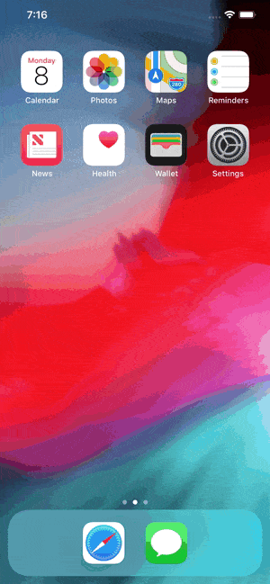

# capa
> Record animated GIFs (and videos) from the iOS Simulator and Android Emulator. Because a GIF is worth a thousand lines of code.



## Motivation
When developing a mobile app within a team that contributes to the code base doing Pull Requests, ~~sometimes~~ it's hard to visualize how the changes will look like in a running App just by looking at the diff. You can help your colleagues by adding an animated GIF into the Pull Request description and this tool wants to make it very simple for you.

## Getting started
1. Install _[gifify](https://github.com/vvo/gifify)_
```sh
brew install node
brew install ffmpeg --with-libass --with-fontconfig
brew install imagemagick --with-fontconfig
brew install giflossy
npm install -g gifify
```

2. Install _simulator-gif_
```gem install simulator-gif```

## Usage
### iOS Simulator
```simulator-gif video.mp4```

### Android Emulator
```emulator-gif video.mp4```

Limitations of the [screenrecord utility](https://developer.android.com/studio/command-line/adb#screenrecord), the Android Emulator recording tool:

* Audio is not recorded with the video file.
* Video recording is not available for devices running Wear OS.
* Some devices might not be able to record at their native display resolution. If you encounter problems with screen recording, try using a lower screen resolution.
* Rotation of the screen during recording is not supported. If the screen does rotate during recording, some of the screen is cut off in the recording.

## Acknowledgments
This tool is a wrapper around `xcrun simctl`, `adb` and [gifify](https://github.com/vvo/gifify)

---

## MIT License
Copyright (c) 2018 crvsh GmbH

Permission is hereby granted, free of charge, to any person obtaining a copy
of this software and associated documentation files (the "Software"), to deal
in the Software without restriction, including without limitation the rights
to use, copy, modify, merge, publish, distribute, sublicense, and/or sell
copies of the Software, and to permit persons to whom the Software is
furnished to do so, subject to the following conditions:

The above copyright notice and this permission notice shall be included in all
copies or substantial portions of the Software.

THE SOFTWARE IS PROVIDED "AS IS", WITHOUT WARRANTY OF ANY KIND, EXPRESS OR
IMPLIED, INCLUDING BUT NOT LIMITED TO THE WARRANTIES OF MERCHANTABILITY,
FITNESS FOR A PARTICULAR PURPOSE AND NONINFRINGEMENT. IN NO EVENT SHALL THE
AUTHORS OR COPYRIGHT HOLDERS BE LIABLE FOR ANY CLAIM, DAMAGES OR OTHER
LIABILITY, WHETHER IN AN ACTION OF CONTRACT, TORT OR OTHERWISE, ARISING FROM,
OUT OF OR IN CONNECTION WITH THE SOFTWARE OR THE USE OR OTHER DEALINGS IN THE
SOFTWARE.