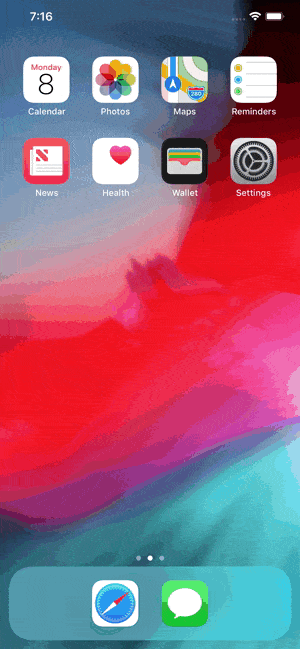
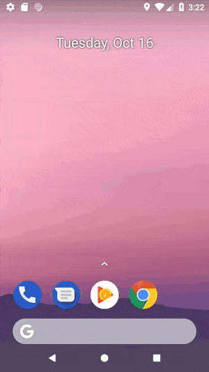

# capa

[](https://travis-ci.com/crvshlab/capa)
[](https://badge.fury.io/rb/capa)

> Record animated GIFs (and videos) from the iOS Simulator and Android Emulator. Because a GIF is worth a thousand lines of code.

|   iOS Simulator  |   Android Emulator   |
|:----------------:|:--------------------:|
|  |  |

## Motivation
When developing a mobile app within a team that contributes to the code base doing Pull Requests, ~~sometimes~~ it's hard to visualize how the changes will look like in a running App just by looking at the diff. You can help your colleagues by adding an animated GIF into the Pull Request description and this tool wants to make it very simple for you.

## Getting started
1. Install _[gifify](https://github.com/vvo/gifify)_
```shell
> brew install node
> brew install ffmpeg --with-libass --with-fontconfig
> brew install imagemagick --with-fontconfig
> brew install giflossy
> npm install -g gifify
```

2. Install _capa_
```s
gem install capa
```

## Usage

```s
capa -o recording -p ios
capa -o recording -p android
```

`capa` will generate a video and a GIF from the iOS Simulator or the Android Emulator. `capa` will try to infer the platform. Alternatively you can select which platform you wish to record in.


Limitations of the [screenrecord utility](https://developer.android.com/studio/command-line/adb#screenrecord), the Android Emulator recording tool:

* Audio is not recorded with the video file.
* Video recording is not available for devices running Wear OS.
* Some devices might not be able to record at their native display resolution. If you encounter problems with screen recording, try using a lower screen resolution.
* Rotation of the screen during recording is not supported. If the screen does rotate during recording, some of the screen is cut off in the recording.


You can find all the options from either command with `--help`

```shell
$ capa -h
> capa will generate a video and a GIF from the iOS Simulator or the Android Emulator. 
capa will try to infer the platform. Alternatively you can select which platform you wish to record in.

 Usage: lib/capa.rb [options]
    -o, --output NAME                Output filename. Defaults to recording
    -p, --platform NAME              Available platforms: ios and android
    -v, --version                    Display version
    -h, --help                       Display help
```

## Acknowledgments
This tool is a wrapper around `xcrun simctl`, `adb` and [gifify](https://github.com/vvo/gifify)
> If your pictures aren't good enough, you aren't close enough.

## License
_capa_ is released under the MIT license. See [LICENSE](LICENSE) for details.